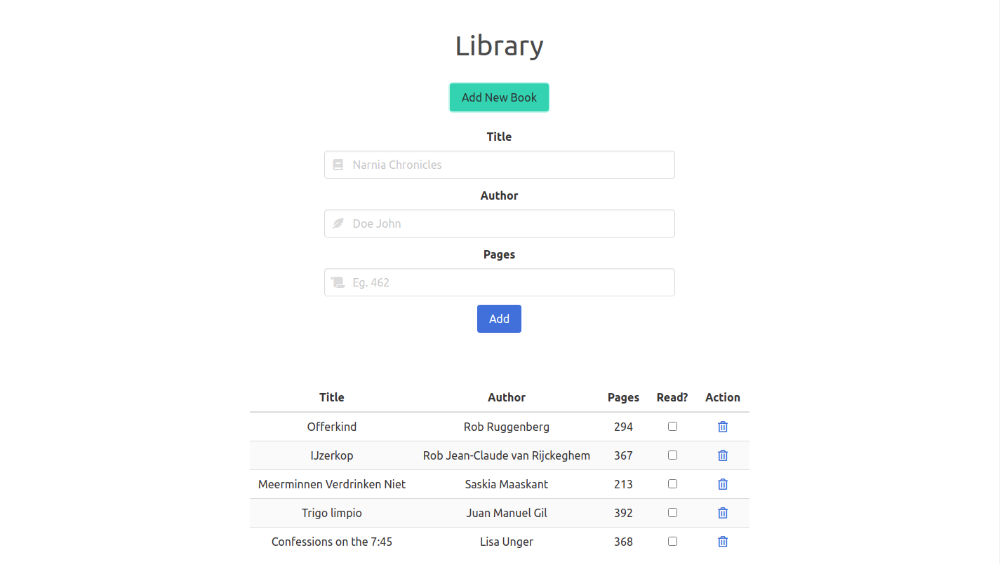

# Javascript Library

> This project was built to practice using Object constructors and local storage in Javascript

## Built With

- Javascript
- Bulma

## Live version

You can check the live version in [this link](https://gscarv13.github.io/library-js/)

## Getting Started

To get a local copy up and running follow these simple example steps.

### Setup and Install

- Clone this repository using the link above (click on the 'code' button)
- Open a terminal and `cd` to the cloned repository

### Usage

- Open the `index.html` file with your browser

## Authors

👤 **Gustavo Carvalho**

- GitHub: [@gscarv13](https://github.com/gscarv13)
- Twitter: [@Gscarv13](https://twitter.com/Gscarv13)
- LinkedIn: [Gustavo Carvalho](www.linkedin.com/in/gscarv13)

## 🤝 Contributing

Contributions, issues, and feature requests are welcome!

Feel free to check the [issues page](https://github.com/gscarv13/library-js/issues).

## Show your support

Give a ⭐️ if you like this project!

## 📝 License

This project is [MIT](LICENSE) licensed.